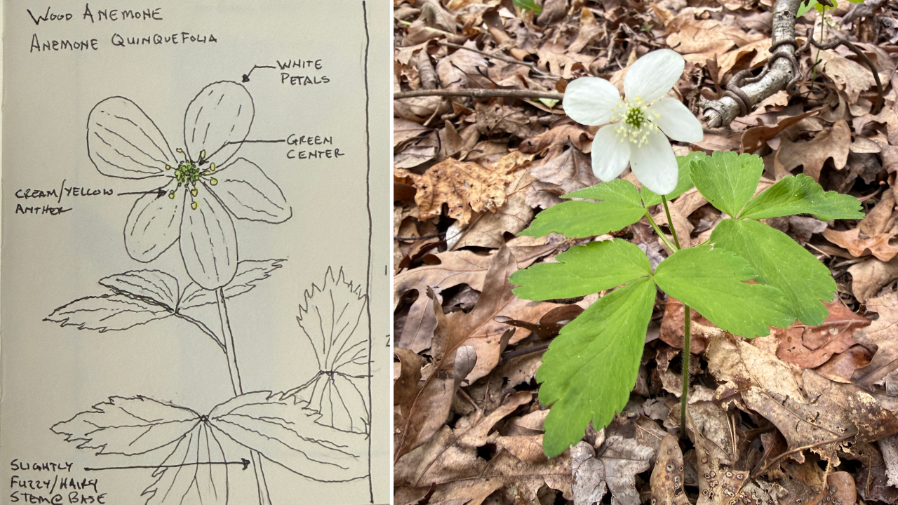
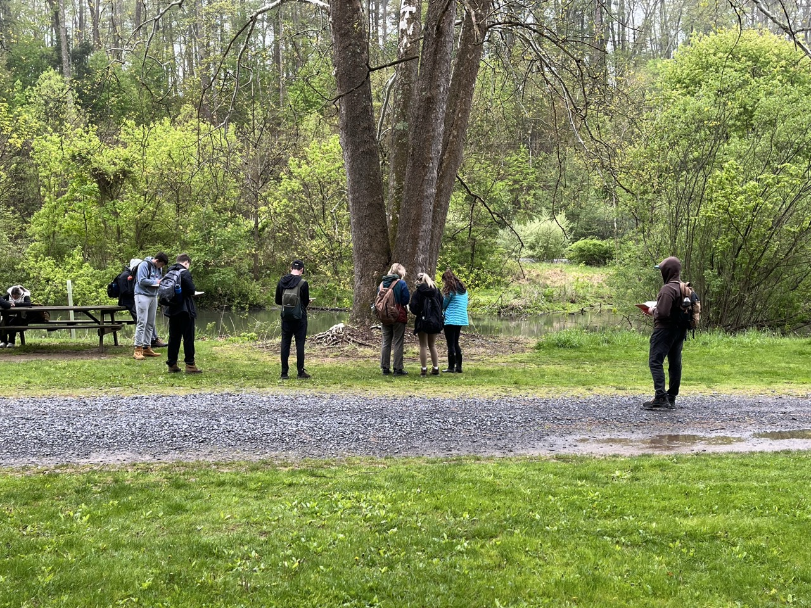
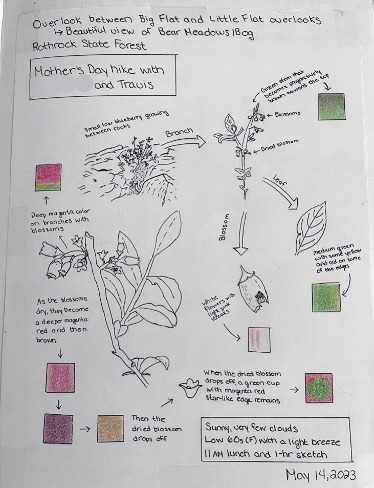

# Assignment Statement: Plant Walk: Botanical Field Notes and Sketching

{#fig-example_journal_entry fig-alt="On the left is a field sketchbook journal entry that contains a hand drawn sketch in pen and ink with small amounts of color using colored pencil of the leaf, flower, and plant form of Anemone quinquefolia, also known as the Wood anemone. On the right is a photo showing the small native wood anemone plant growing on a woodland floor, featuring lacy, compound green foliage and a singular starry white flower blooming atop a thin, upright stalk. " fig-align="center" width=100%}

## Overview

### Point Value
45 points

### Duration
This assignment will last the whole semester; scheduling is weather-dependent (see the syllabus for weather-related policies).

### Submissions
Note: Due dates are documented within the [course schedule](02_schedule.qmd). 

- Submission 1
- Submission 2
- Submission 3

## Introduction
Plant walks, along with your associated field notes and botanical sketching, form the core activity of Larch 245. This activity involves observing plants in the field, taking notes on field lectures and your own observations, and sketching plant details. Hand-taken notes and sketching are tactile and emotive, so that knowledge sinks in more deeply (as a teacher used to say, “you learn through your fingertips”). While note-taking is in danger of becoming a lost art, nothing (yet) replaces field notes and engaging with plants in their places. These beliefs are supported by substantial research (Duran & Frederick, 2013; Flanigan et al., 2024; Smoker et al., 2009).

{#fig-students_sketching fig-alt="A group of students in casual outdoor clothing stand along a gravel road, sketching a large river birch with its distinctive peeling bark. The tree sits beside a tranquil stream, with a dense, green forest rising in the background." fig-align="center" width=100%}

The sketching part of the equation demands that you look closely and patiently at parts of plants and their gestalt (a plant’s whole ‘being’) to get to know it personally. Frederick Franck (1993) said, 

>“I have learned that what I have not drawn, I have never really seen.” 

By drawing, you see things you wouldn’t otherwise have noticed. Drawing a plant is like smelling its flowers—it’s just another way to **experience** it intellectually and with your various senses.

## Field Activities and Instructions
While we will strive to complete field activities during class time, there may be occasions where you will need to finish up on your own before the next class (aka “homework”). On-site plant learning will take place at the Core Campus and the Arboretum. 

### Required Field Book Purchase
**You must purchase your own Larch 245 dedicated field journal/notebook and bring it to the first plant walk.** I suggest a size in the 5.5” x 8” to 8.5” x 11” range, unlined (blank), hard-backed, and of good quality (sheet weight of 50 lb. or more). I will ask that you submit notebook scans at several points in the semester, so don’t share the field book with another course; dedicate it solely to Larch 245.  Please put your name clearly on the inside front cover or the first page of the field book. Alternatively, you may prepare notes and/or sketches on an iPad or electronic sketchpad in the field and then compile your field book submissions entirely digitally.

### Plant Walks
How we organize for our plant walks will depend on the number of students enrolled in the course and if we have been allocated a teaching assistant (TA). Both options are outlined below. 

***Class size of 25 or less students with no dedicated TA.***
The class **will not split into groups.** On the first day I will lead the field notes activity. Then, for our next campus-based class, we will return to the same site for our botanical sketching experience – remember, these are public spaces; be considerate of others. 

***Class size of 25 students or more with a dedicated TA.***
The class will split into two groups for plant walks. **The groups are posted on Canvas**; you can not switch groups. I will lead one group in the field notes activity. Our TA will take the other group and facilitate the Botanical Sketches activity. Then, for the next campus-based class, we will switch groups and return to the same site, so you will have a note-taking experience and a botanical sketching experience at each site. We will split into two groups so that we don’t crowd garden areas – remember, these are public spaces; be considerate of others. Then, the two groups will rotate activities from one class session to the next.

Plant walk locations are outlined in the @sec-plant_maps, as are the names of the plants we will cover for each walk. **Ensure you print a copy of the list or write them in your sketchbook as I will not be spelling them in the field.**

In the field you are responsible for the following:

1. In your field books, always begin each class session with the headings of **Location** and **Date**.
2. For Plant Walks—Field Notes, we will study 7 - 15 plants:
    i.  During field walks, jot down the **Scientific Name** and **Common Name**; refer to the maps and plant lists, which will have both names.
    ii. **Listen to and take notes on my field lecture.** Be thorough. This is a key part of your course grade! You’ll be writing fast, but try to keep notes legible. Bullets are fine.
    iii. Take a moment to get up close and **observe the plant** being discussed; be curious. Generally, we won’t slow down to sketch during my field lectures, but you may have a few seconds to doodle or write a few personal observations quickly – or you can always go back to the plant after class ends.
3. For Plant Walks—Botanical Sketching:
    i. **Choose five plants** from each plant walk list. Reminder: refer to the plant walks web map for each plant's list of locations. These are what you’ll be studying and sketching. The purpose of choosing five plants is to spread out as a class and not damage the surrounding vegetation. 
    ii. **Record Scientific Name and Common Name**.
    iii. **Examine** the plants closely, both up close for details and from a few paces back for the ‘gestalt’ (i.e., personality, overall character, and form)
    iv. **Sketch** carefully and insightfully as you go. I recommend using Pencil because it offers the best sketching experience and error correction. It also writes in the rain, but a rain-proof pen is also OK.
    v. **Add annotations (labels, brief notes)**.  **Use actual botanical terms**. As guides for choosing the appropriate words and descriptions, reference these three PDF files: i) [Leaf and Tree Forms, Patterns, and Parts](https://pennstateoffice365-my.sharepoint.com/:b:/g/personal/tlf159_psu_edu/IQAa7JH7mr8JQpvwg7tDPaeGAbpV98qAqbbuPNxLcxkM8Cw?e=Ur0Gle), ii) [External Form of a Woody Twig](https://pennstateoffice365-my.sharepoint.com/:b:/g/personal/tlf159_psu_edu/IQAGeqmlnpC3TIe3E_eicyJwAc32GdumM6zRFlFVqJaTwlg?e=7gUojA), and iii) [Glossary of Botanical and Horticultural Terms](https://pennstateoffice365-my.sharepoint.com/:b:/g/personal/tlf159_psu_edu/IQDj0zvnIyzgSZfNDT_dNQjhAbp9mK0nlNNQ6RBMcINSXLc?e=f7V2Yb).
    vi. Two things are essential in botanical sketching: first, **sketch the details and forms of the plant (i.e., more than one sketch per plant!!!)**. Second, **add notations that label, describe, and question the sketch** – like the visual notes you’ve done earlier in the curriculum. Freehand line sketches are best, though using tonal values is OK, too. Don’t get bogged down in getting things perfect. Although your field sketches need not be ‘pretty,’ they will have a certain visual appeal in their attention to detail. See the example in @fig-example_journal_entry; note this example does not include all the required text (e.g., title, description, etc.) and annotations, but should serve as an example of sketching and some of the required annotations.

{#fig-example_journal_entry fig-alt="A field sketchbook journal entry that contains hand drawn sketches of the leaf, flower, and plant form of Vaccinium angustifolium, also known as the Low bush blueberry. The page also contains green color swatches highlighting the observed spring leaf color and the pink to purple of the lower and new stem growth, and white flower color." fig-align="center" width=65%}

## Field Notebook Scan Compilation and Submissions
I require three cycles of notebook submissions to be scanned/photographed and compiled for submission to the Larch 245 Canvas drop folder. **Keep submissions to 5 MB or less**. I require submission resolution to be between 120 and 150. You may use a scanner or take good-quality and neatly cropped cellphone photos of each page. In either case, **you must compile the scans/photos into a single, multi-page, compressed PDF file**. I suggest you compile it using Acrobat Pro > Combine Files, or a similar tool. Ensure that the gray tones show, the line quality is decent, and the submission is **legible and well-organized**. Also, **ensure that you have the pages rotated in the correct orientation**! **Always show your name on the first sheet** of the compiled file and ensure your file is named as follows: Last name_first name_date.pdf. For example, mine would be: flohr_travis_05102026.pdf.

## Evaluation Rubric Requirements
Field notes and Botanical Sketches conducted during Plant Walks are substantial portion of your overall grade. There will be three submissions, comprising your scanned/photographed work (2 MB max. per submission), submitted to the appropriate Canvas Larch 245 assignment submission folder. The details of the evaluation rubric for each submission are presented in @tbl-bfn_eval. 

| Description                        | Value            |
|:-----------------------------------|:-----------------|
| ***Field Notes***                  | ***10 points***  |
|Are your field notes robust and complete? | 2 points|
|Do they thoroughly capture the content of field lectures, discussions, and observations of the plants encountered on site?| 1 point |
|Do your notes show curiosity? | 1 point |
|Do they pose perceptive questions or commentary? | 1 point |
|Are the notes legible and well-organized?| 1 point |
|Are site locations and dates provided? | 1 point |    
|Are plant names spelled correctly?     | 2 points |
|Is the field notebook (incl. sketches) coherent, neat, and well-organized? | 1 point |
| ***Botanical Sketches***                  | ***5 points***  |
|Are plant names spelled correctly?     | 2 points |
|Do your Botanical Sketches show evidence of close and accurate examination of the plants and plant parts?                        | 1 point  | 
|Are sketches accompanied by annotation (i.e., visual notes) – labels, brief technical descriptors, perceptive questions – appropriately and consistently? | 1 point | 
|Are your annotated botanical sketches complete and visually appealing? | 1 point|

: Botanical field notes and sketching evaluation breakdown. {#tbl-bfn_eval}

## Plant Walk: Maps and Plant Lists {#sec-plant_maps}
The information below lists the plant-walk meeting locations and the plants we will cover at each site. Please come prepared with the plant names and their spellings, as I will not spell them out in the field. These locations and plant lists are subject to change because of weather and because landscapes are living, changing systems. A plant present one week may be removed or die before we reach it. However, no quiz questions will be based on plants we do not discuss in the field.

```{r }
#| warning: false
#| echo: false
#| message: false
#| label: render-walk-locations

# call and run script for class room building location
source("scripts/03_plant_walk_info.r")

walk_assets <- readRDS("data/processed/plant_walk_assets.rds")

sections <- Map(function(nm, x) {
  quiz_n <- unique(x$data$Quiz)[1]

  tags$div(
    tags$h3(paste0(quiz_n, ": ", nm)),
    make_plant_map(x$data),
    make_plant_table(x$data),
    tags$hr()
  )
}, names(walk_assets), walk_assets)

tagList(sections)
```


