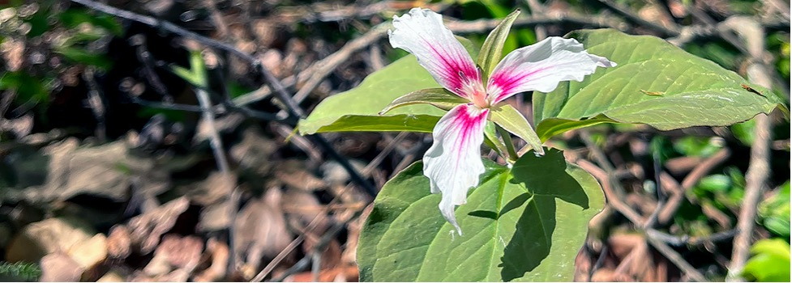

# Assignment Statement: Quiz

{#fig-example_journal_entry fig-alt="A photo of *Trillium undulatum* (Painted trillium), a slender, 12-inch painted trillium plant rising from the forest floor. Below the single white and pink blossom is a whorl of three large, pointed blue-green leaves. The flower features three wavy white petals with a vivid red-purple pattern in the center." fig-align="center" width=100%}

## Overview

### Point Value
35 points

### Duration
This assignment will last the whole semester; scheduling is weather-dependent (see the syllabus for weather-related policies).

### Submission Dates
Note: the quiz dates are on the calendar in @sec-course_schedule. You can also find the list of plants for each quiz under the appropriate section of the plant walk list and maps of @sec-plant_maps.

- Quiz 1: Pollinator & Bird Garden
- Quiz 2: Stuckeman
- Quiz 3: Hintz Alumni Garden Areas
- Quiz 4: Event Lawn and Strolling Gardens
- Quiz 5: Children’s Garden
- Quiz 6: Schreyer Garden Areas
- Quiz 7: Electrical Engineering West

## Introduction
As detailed in the Syllabus, quizzes are integral to our Larch 245 goal of **learning and retaining plant names and their attributes**. They will work hand in hand with Fieldnotes, in which further details on plants and their ecological, socio-cultural, and landscape contexts are explored in greater depth. By the end of the semester, you will have been quizzed on approximately 50-120 plants (both Common and Scientific names, with some dominant plant characteristics) across a range of plant forms, including trees, shrubs, and herbaceous plants. Many of these plants are also very likely to appear again in your Plant Palettes group projects that will occur toward the latter part of the semester, as the weather begins to prohibit fieldwork (and in future courses, particularly Planting Methods).

## Procedure
There will be seven quizzes in total, all via Canvas. Each quiz will be scheduled for the week following a specific Core campus—or Arboretum-based landscape or garden setting (e.g., Alumni Garden, Children’s Garden, Pollinator and Bird Garden). The submission dates on the course schedule outline the general timing and areas covered (**subject to revision**, depending on preceding plant walk weather).

## Evaluation
Each of the **seven quizzes** is **worth five points** of the course grade, for a **total of thirty-five points**. Please contact the instructional team if you have any questions about your grade. If you miss a quiz due to an authorized absence, please arrange to take it as soon as possible at a mutually convenient time.

## Academic Integrity and Misconduct
Please refer to the Syllabus for the course policy on academic misconduct regarding quiz-taking. **Simply put, do not cheat.**
