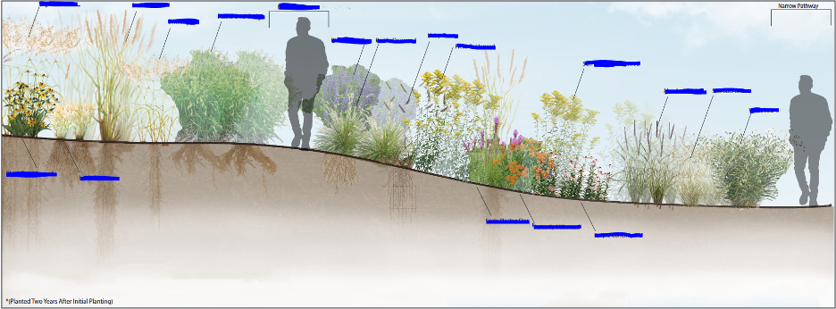

# Assignment Statement: Plant Community Palettes and Policy Advocacy

{#fig-example_plant_section fig-alt="A previous student's landscape planting conceptual section rendering of a planted landscape along a gently sloped pathway labeled “Narrow Pathway.” The section shows layered native plantings—including ornamental grasses, flowering perennials, and shrubs—arranged in drifts across the slope. Two human silhouettes provide scale, one near the center and one at the right edge. Aboveground foliage varies in height, texture, and bloom color (yellow, purple, orange, and white), while below ground root systems are depicted extending into the soil profile. Plant callouts label species throughout the planting. A note indicates the planting is shown two years after initial installation." fig-align="center" width=100%}

## Overview

In this project, student teams will translate ecological plant knowledge into a concise public-facing communication package for the **City of State College, Pennsylvania**. Working in groups of **3–4 students**, you will develop a **2-3 page fact sheet** and a **1-page memo** that advocate for native planting, habitat protection, and a reduction in conventional lawn dependence in public and private landscapes.

This assignment asks you to combine plant selection, visual communication, and policy argument into a persuasive, professional package designed for a civic audience.

### Point Value
20 points

### Duration
This assignment will be towards the end of the semester, after our plant walks (the exact start to the project will be weather dependent).  

### Submission Dates
Note: submission dates are in the [course schedule](02_schedule.qmd).

- Concept + site type proposal check.
- Plant palette + evidence check.
- Draft communication check.

## Introduction

This project is meant to help you move from plant knowledge to public advocacy. Throughout LARCH 245, you have been learning how individual plants function in landscape contexts and how plant species come together to form ecologically meaningful communities. You have considered plants not just as isolated objects, but as participants in systems of habitat, aesthetics, performance, and place. This assignment asks you to bring that knowledge into a public-facing format that is both graphic and persuasive: a plant community palette and policy memo.

By the end of the project, you should be able to communicate how thoughtful native planting can do more than beautify a site. It can improve ecological function, support biodiversity, manage stormwater, sustain pollinators, and strengthen the long-term health and resilience of landscapes. Just as importantly, you should be able to translate those landscape benefits into civic language—showing how local ordinances and municipal standards shape what gets planted, what gets protected, and what kinds of public and private landscapes become possible. In this way, the assignment moves beyond design representation and into advocacy, asking you to use plants, graphics, and evidence to make a clear case for better landscape policy in the City of State College.

## Project Goals
Your team will:

- assemble a targeted plant list for a landscape intervention,
- show how the design changes a site through before-and-after graphics,
- explain environmental and economic benefits using clear, evidence-based facts,
- and make a direct policy recommendation to the State College Planning Commission.

## Deliverables
### 1. Fact Sheet: 1–2 pages
Create a visually clear fact sheet that includes all of the following:

- **Plant list** for the proposed intervention
- A **before-and-after perspective** showing the site transformation
- A **before-and-after section/elevation** showing the landscape intervention at ground level and planting structure
- Concise facts on the following benefits:
  - **economic benefits**
  - **biodiversity benefits**
  - **stormwater benefits**
  - **pollinator benefits**

The fact sheet should read like a public education handout: concise, graphic, and easy for a non-specialist audience to understand.

### 2. One-Page Memo
Write a professional memo addressed to the **City of State College, PA** that challenges the city to revise lawn standards and adopt ordinances that support:

- **native planting**
- **habitat protection**
- reduced reliance on turf lawn where ecologically unnecessary

The memo should be persuasive, respectful, and grounded in ecological and civic reasoning. It should clearly identify what policy change you are requesting and why it matters.

### 3. Presentation
Your group will present the project to the class. Presentations should explain:
- the site or landscape intervention,
- the proposed plant community,
- the benefits of the design,
- and the policy message to the City of State College.

## Interim Progress Checks
To support steady progress and timely feedback, each group will complete **three interim progress checks** during the project timeline. These checks are meant to help you refine your ideas early, confirm that your evidence is on track, and avoid last-minute problems.

### Progress Check 1: Concept + Site Proposal
**Due: early in the project timeline, before detailed drafting begins**

Submit a brief concept statement and preliminary site proposal that includes:
- the chosen **garden, yard, or landscape intervention type**,
- the intended **site or setting**,
- a short summary of the design idea,
- and a rough **before-and-after sketch, diagram, or thumbnail** showing the intended change.

This check should confirm the overall direction of the project.

### Progress Check 2: Plant Palette + Evidence Review
**Due: midway through the project timeline**

Submit a draft plant palette and a short evidence check that includes:
- a preliminary **plant list** with enough species to show design intent,
- a brief note on how the palette supports the site conditions and design goals,
- and draft facts or source notes for the required benefit categories:
  - economic,
  - biodiversity,
  - stormwater,
  - and pollinator benefits.

This check should show that your design and research are developing together.

### Progress Check 3: Draft Communication Review
**Due: shortly before final submission**

Submit a near-complete draft of the communication package, including:
- the **1–2 page fact sheet**,
- the **one-page memo**,
- the **before-and-after perspective**,
- and the **before-and-after section/elevation**.

This check should verify that the visuals are legible, the text is concise, the memo makes a clear policy request, and the package is ready for final refinement.

## Submission Requirements
Each group must complete all of the following:

1. **Submit the fact sheet and memo to Canvas**
2. **Present the project in class**
3. **Submit the final project to the State College Planning Commission**

### Canvas Submission
Upload one PDF that includes:
- the 1–2 page fact sheet, and
- the 1-page memo.

### External Submission
After class presentation and instructor review, the final project must also be submitted to the **State College Planning Commission** in the required format.

## Design Expectations
Your graphics and text should work together to communicate a clear proposal. The fact sheet should include:
- readable labels,
- consistent graphic style,
- strong hierarchy of information,
- and visuals that show both the ecological logic and the design intent of the proposal.

Your memo should use professional, concise language and support its claims with credible sources.

## Suggested Content for the Fact Sheet
Your fact sheet may include, as appropriate:
- project title and team names,
- site name or intervention type,
- plant palette organized by layer or function,
- brief notes on plant characteristics,
- annotated diagram(s),
- and short benefit statements with statistics or citations.

## Grading Emphasis
Your project will be evaluated on:
- clarity and completeness of the plant list,
- quality of the before/after visual communication,
- accuracy and relevance of benefit facts,
- strength of the policy memo,
- and overall graphic and verbal communication.

## Expectations for Sources
All factual claims should be based on reliable sources. Cite sources clearly on the fact sheet and in the memo. Use botanical, ecological, municipal, and planning refer

## Evaluation Rubric Requirements

Three interim progress checks are included as small, required submissions to support steady development of the project. The details of the evaluation rubric are presented in @tbl-palette_rubric.

| Description | Value |
|:---|:---:|
| ***Interim Progress Check 1: Concept + Site Proposal*** | ***0.5 points*** |
| Submitted on time and includes intervention type, site/setting, a brief concept statement, and a rough before/after thumbnail or diagram. | 0.5 points |
| ***Interim Progress Check 2: Plant Palette + Evidence Review*** | ***0.5 points*** |
| Submitted on time and includes a preliminary plant list, brief notes on site/design fit, and draft facts or source notes for the required benefit categories. | 0.5 points |
| ***Interim Progress Check 3: Draft Communication Review*** | ***0.5 points*** |
| Submitted on time and includes a near-complete draft of the fact sheet, memo, and required visuals. | 0.5 points |
| ***Plant List*** | ***2.5 points*** |
| Is the plant list complete and appropriate for the proposed site and design intervention? | 1 point |
| Does the palette show a thoughtful range of plants, layers, and ecological functions? | 1 point |
| Are plant names accurate, organized clearly, and formatted consistently? | 0.5 points |
| ***Before/After Visual Communication*** | ***4 points*** |
| Does the before/after perspective clearly show the intended landscape transformation? | 1 point |
| Does the before/after section/elevation clearly communicate planting structure and ground-level intervention? | 1 point |
| Are the visuals convincing, legible, labeled, and coordinated with the written content? | 1 point |
| Does the pair of visuals effectively support the design idea and public message? | 1 point |
| ***Benefit Facts*** | ***4 points*** |
| Are the economic benefits accurate, relevant, and clearly stated? | 1 point |
| Are the biodiversity benefits accurate, relevant, and clearly stated? | 1 point |
| Are the stormwater benefits accurate, relevant, and clearly stated? | 1 point |
| Are the pollinator benefits accurate, relevant, and clearly stated? | 1 point |
| ***Policy Memo*** | ***5 points*** |
| Does the memo make a clear request that the City of State College revise lawn standards and adopt native planting/habitat protection ordinances? | 1.5 points |
| Is the argument persuasive, respectful, and appropriate for a civic audience? | 1.5 points |
| Is the memo supported by evidence and grounded in ecological and civic reasoning? | 1 point |
| Is the memo concise, professional, and well organized? | 1 point |
| ***Overall Graphic and Verbal Communication*** | ***3 points*** |
| Is the overall design layout clear, readable, and visually well organized? | 1 point |
| Is the verbal presentation clear, confident, and well structured? | 1 point |
| Are sources cited properly and do the graphics and text work together effectively? | 1 point |

: Plant community palette and policy advocacy evaluation breakdown. {#tbl-palette_rubric}

