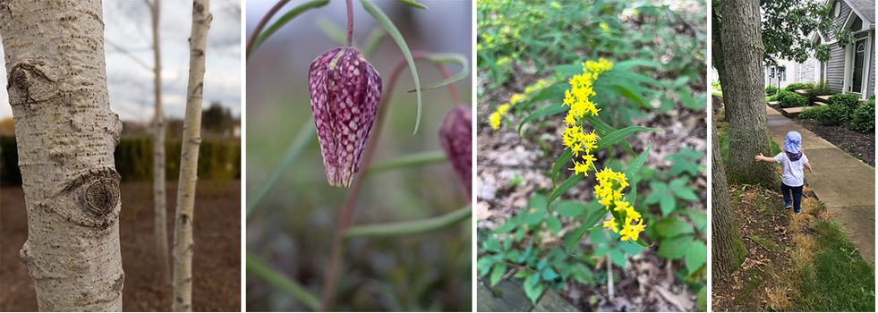
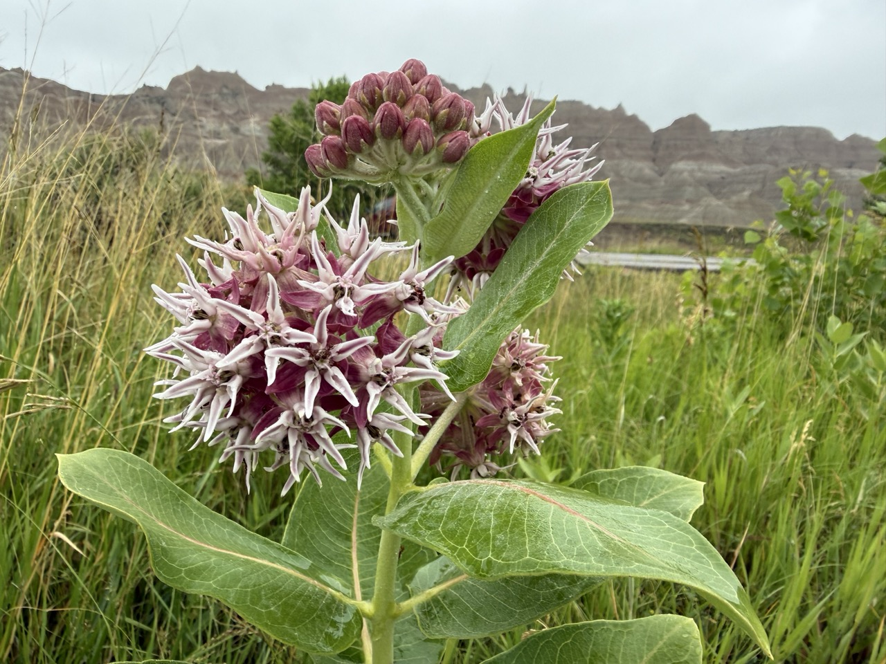
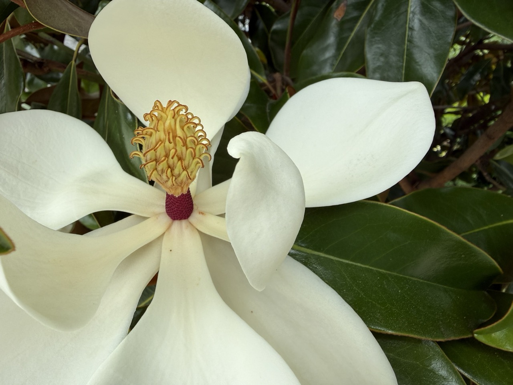
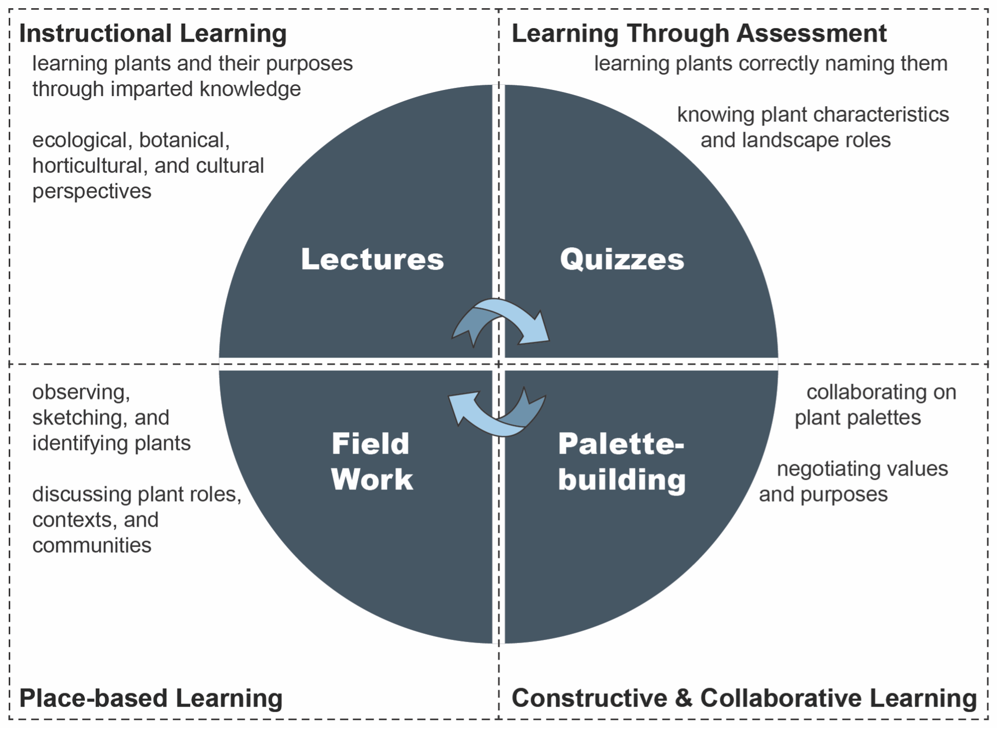

```{r}
#| label: setup
#| include: false
current_year <- format(Sys.Date(), "%Y")
```

{fig-alt="A four panel image. The first image panel contains a photograph of quaking aspen tree bark. The second panel image contains the pink, purple mottled drooping bell shaped bloom of a Snake's-head fritillary flower. The third panel image is the yellow blooms of a blue-stemmed goldenrod. The fourth panel image is of a child running off a sidewalk to hug a large oak tree trunk."}

# Syllabus {.unnumbered}

## Course Information

### Meeting Times

Monday and Wednesday, 2:30-3:45 PM

### Location(s)

Classroom: 113 Chemical and Biomedical Engineering Building
<br>

```{r class room map}
#| warning: false
#| echo: false
#| message: false

# call and run script for class room building location
source("boilerplate/00_classroom_map.R")

map_classroom
```

<br> 
Outdoors: UP campus and arboretum

### Faculty

Travis Flohr, Ph.D., [tlf159\@psu.edu](mailto:tlf159@psu.edu), 419 SFB, office hours by appointment.

### Teaching Assistant

This year there will be no teaching assistant for this course.

### Credits

3-credits

### Course Costs
We have tried to keep course costs to a minimum. Feel free to leverage your existing supplies (e.g., pens, pencils, erasers, and pencil sharpeners). Still, @tbl-course_costs is our best estimate of course costs based on past course experiences. You may use markers or pens other than those listed below; the key is being able to draw botanical illustrations and take field notes.

| Materials and Supplies                         | Total Costs |
|:------------------------------------------------|-------:|
| Field Journal                                   | $25.00 |
| Fineliner Technical Pens or Sharpies            | $15.00 |
| Graphite Pencil Set, with multiple 3+ hardnesses| $10.00 |
| Pencil Sharpener                                | $2.00  |
| ***Total Costs***                               | ***$52.00*** |

: General course grading rubric and scale. {#tbl-course_costs}

** Disclaimer. Prices are as accurate as those provided in the summer of Published in `{r} current_year`.

Please feel free to express yourself artistically with supplies other than those listed above. For example, you can embellish your botanical illustrations with colored pencils, markers, and/or watercolors (embellishments are not required, but good drawing is). 

## Course Description and Objectives

Larch 245 Ecology and Plants II is the single course in our curriculum that focuses most on **learning about plants and constructing plant palettes** appropriate to various designed landscapes and their contexts. The course strongly emphasizes understanding plant ecology and planting culture, critical aspects of a landscape architect’s education. Plants, often under-appreciated in our discipline and allied professions, are complex living organisms that take root, grow, interact with other life forms and the surrounding environment, and die and regenerate. As life forms on this earth, they have **intrinsic value**—value for their own sake.

{fig-alt="A vibrant, macro photograph focusing on the flower head of a Showy Milkweed. The spherical cluster of fragrant blooms displays intricate, star-like purplish-pink petals with elevated, crown-like hoods in the center of each individual floret."}

It's important to note a significant societal trend towards ‘plant blindness’—the inability to appreciate plants in their environment for their aesthetic or biological characteristics (Brzuszek et al., 2011; Griswold, 1994; Wandersee & Schussler, 1999). This lack of attention to plants stems from an anthropocentric view that ranks plants as inferior to animals, which is a bias that needs to be overcome. Given our discipline’s focus on environmental sustainability, fostering relationships among humans, other life forms, and natural processes is crucial. This is one way to effectively promote several key UN Sustainable Development Goals, including Good Health and Well-being \[3\], Industry, Innovation and Infrastructure \[9\], Reduced Inequalities \[10\], Sustainable Cities and Communities \[11\], Responsible Production and Consumption \[12\], Climate Action \[13\], and Life on Land \[15\] (United Nations, 2024).

<figure>
    <iframe width=100% height="400" src="https://www.youtube.com/embed/0XTBYMfZyrM?si=k8B_Ud4D44qa-Dg4" title="YouTube video player" frameborder="0" allow="accelerometer; autoplay; clipboard-write; encrypted-media; gyroscope; picture-in-picture; web-share" referrerpolicy="strict-origin-when-cross-origin" allowfullscreen></iframe>
    <figcaption>UN Sustainability Goal Overview Video. Source: United Nations</figcaption>
</figure>

Moreover, planted landscapes **perform well** when well-designed, managed, and placed at the right time and in the right place. That is, they provide essential instrumental values such as ecosystem services. According to Michigan State University Extension (2024), Kremer et al. (2016), and Quijas et al. (2010), plants provide essential ecosystem services across all urban systems, including enhancing biodiversity, carbon sequestration, watershed management, moderating microclimates, and supporting pollinators. They can also increase residential and commercial land values (Minor et al., 2023; Siriwardena et al., 2016).

Perhaps most importantly, for aspiring and practicing landscape architects, plants are beautiful and intriguing in their own right. They articulate and animate space, thus helping create memorable places. Plants express our values. They often deeply express cultural values in their landscape setting, good and bad, inclusive or exclusive. A large body of research even shows that plants can enhance mental well-being, stimulate workplace productivity, and reverse nature deficit disorder (Kalantzis, 2016; ten Brink et al., 2016).

{fig-alt="A close-up of a single, freshly bloomed Southern Magnolia flower. Six thick, waxy, creamy-white petals curl outward in a cup shape. In the center, a dense cone of spirally arranged golden-yellow stamens contrasts with the soft white of the petals against the glossy, dark-green, leathery leaves in the background."}

In summary, **plants play a vital role in sustaining life on planet Earth**. As landscape architects, we have the privilege (I’d argue it is a moral imperative) of helping set these benefits in motion. ASLA has also integrated this professional value and moral imperative into its mission (American Society of Landscape Architecture, 2022). Let’s shift from ‘plant blindness’ to ‘plant sightedness’ (and all the other senses!), including how plants can be activated in the landscape. Larch 245 will help you on this journey.

Larch 245 is part of the core professional sequence in our accredited program. It extends the basic ecology and introduction to plant communities gained in Larch 145 (Ecology and Plants I). This course is a key prelude to Larch 246 (Ridge & Valley field course) and Larch 335 Planting Methods. The more you learn in Larch 245, the more rewarding subsequent courses and your profession will be. This course aims to develop your knowledge of native and introduced (i.e., ‘non-native’) plants in their landscape and ecosystem contexts, which is vital to your growing abilities in landscape architecture.

## Course Outcomes

Upon the completion of Larch 245, you should:

-   be able to correctly **identify and name** 70-120 plants (in small batches) drawn from across a broad spectrum of woody and herbaceous landscape species and their cultivars and, where relevant, associate these plants with their natural plant communities.
-   be able to associate select plants with their **landscape performance**[^index-1] attributes, their ecological and biological/bioclimatic contexts, and their aesthetic, social, cultural, and functional roles and capabilities.
-   be able to **conduct plant observation and identification techniques**, mostly in the field, but, depending on the weather, also in the lab/studio;
-   become more adept at **developing woody and herbaceous plant palettes** for select landscape genres, from designed ecosystems to urban landscapes to ornamental gardens, including being able to discern when it’s best to use either native or non-native species/cultivars; and
-   **appreciate plants more deeply**, recognize them as essential tools in the landscape architect’s repertoire, and understand their role as **key contributors to advancing the UN Sustainable Development Goals**.

[^index-1]: **Landscape performance** is “a measure of the effectiveness with which landscape solutions fulfill their intended purpose and contribute to sustainability. It involves assessment of progress toward environmental, social, and economic goals based on measurable outcomes (Landscape Architecture Foundation, 2024).”

## Course Structure

Learning theory strongly advises blending several approaches to build knowledge of plants, their purposes, appropriate landscape contexts, and ecologies. As shown in Figure 1, we will interweave four learning formats: Instructional, Place-based, Assessment-based, and Collaborative/Constructive. I hope the combination of **academic, experiential, and interactive activities** will quickly build your plant knowledge and appreciation, providing a foundation for lifelong fluency with plants and their application in landscape and ecosystematic settings.

{#fig-course_structure fig-alt="A descriptive sentence about the image content."}

## Course Learning Formats and Evaluation

### Lectures and Discussions

Lectures and discussions will inform plant walks, quizzes, and your collaborative projects. Lectures may also include other classroom-based activities. The frequency of lectures and discussions will depend on the weather during scheduled plant walks (i.e., we will conduct plant walks when the weather is good). We may have guest lectures. Penn State allows in-person courses to deliver up to 25% of its content online. I reserve the right to use online delivery when and if necessary; if changes to in-person become necessary, we will use Zoom, and I will send out a Canvas announcement before class.

### Plant Walk Botanical Field Notes

**You must purchase your own field notebook (unlined) before the first Plant Walk.** These will contain both notes on field lectures and your observations and botanical sketches. More information is provided in the [Plant Walk assignment statement](03_assignment_statement_plant_walk.qmd).

Field-based instruction and observation form the core of LArch 245, i.e., Plant Walks. The best way to learn about plants is to study them where they live, face-to-face (actually, face-to-plant). Fortunately, fantastic resources are close at hand. Our primary ‘plant walk’ locations will be split between the Penn State main campus (e.g., Schreyer Garden, Alumnae Gardens, Stuckeman area, among others) and the Arboretum’s cultivated collections at the H.O. Smith Botanic Gardens (you can find the plant walk meeting locations in the linked assignment statement above. To assist in your success, I provided a few notes about Plant Walk Botanizing/Field notetaking below:

-   When botanizing on campus (including the arboretum), we typically meet at the designated field spot at the beginning of class, so please arrive a few minutes early. At the Arboretum, we usually meet at the central Event Lawn, the meadow bridge, or the Overlook Pavilion shelter on rainy days.
-   The arboretum’s H.O. Smith Botanic Gardens’ online Plant Finder (ArcGIS mapping) is available at: [https://datacommons.maps.arcgis.com/apps/webappviewer/index.html?id=88d9267530dc48db8635703130bb084e.](https://datacommons.maps.arcgis.com/apps/webappviewer/index.html?id=88d9267530dc48db8635703130bb084e){target="_blank"} Cell phone referencing of the Plant Finder while on site is encouraged; WIFI extends through most (but sometimes not all) of the gardens. In some peripheral areas, you may need to use cell data. Alternatively, you can prepare on your computer in advance; map printouts can help locate plants. Locating some plants can be tricky, so feel free to work together with your classmates. The TA and I will help you locate the designated plants to study.
-   How to read plant labels at the H.O. Smith Botanic Gardens: [https://arboretum.psu.edu/gardens/living-plant-collections/#custom-collapse-0-5.](https://arboretum.psu.edu/gardens/living-plant-collections/#custom-collapse-0-5){target="_blank"}
-   When on-site, be thoughtful and courteous. Please do not trample through planted beds, and resist the temptation to pick leaves, twigs, or flowers unless I give permission. I may occasionally remove a leaf, fruit, or small twig to share with you, but only for educational purposes and infrequently. If each student removed plant parts, the impacts would be significant.
-   We will be studying in some locations that accommodate beneficial pollinators. Anaphylactic shock resulting from insect stings is very rare, but if you have any concerns, please prepare accordingly, and feel free to talk with instructors about alternative learning accommodations. Be prepared for inclement weather. Plant walks will only be canceled (and replaced with indoor activities) during heavier rainfall or thunderstorms.

### Quizzes

Quizzes will follow soon after each Plant Walk. Performing well on quizzes will require learning and retaining scientific and common plant names, characteristics, and purposes. Studying for quizzes will require discipline, good field notebooks, and repeated practice (I recommend flashcards). You will take quizzes via Canvas. More information can be found in the [Quiz assignment statement](04_assignment_statement_quiz.qmd).

### Collaborative Project

The course will conclude with a collaborative, group-based presentation of the project. This project will occur later in the semester when the weather is less reliable, and we have finished most of our plant walks. The project will require you to add plants to a plant database and community-based plant palette and describe plant/mutualistic food web relationships. I will provide project details in a separate assignment statement. You can find more information in the [Plant Palette assignment statement](05_assignment_statement_plant_palette.qmd).

### Grade Allocation

Semester grades will be allocated as outlined in @tbl-grade_allocation. Details for each graded deliverable will be provided within individual deliverable statements.

| Description                        | Value            |
|:-----------------------------------|:-----------------|
| ***Field Trip Form Submission***   | 5 points         |
| ***Plant Walk Botanical Field Notes***|               |
| Interim progress check 1           | 15 points        |
| Interim progress check 2           | 15 points        |
| Final submission                   | 15 points        |
| ***Quizzes***                      |                  |
| Quiz 1                             | 5 points         |
| Quiz 2                             | 5 points         |
| Quiz 3                             | 5 points         |
| Quiz 4                             | 5 points         |
| Quiz 5                             | 5 points         |
| Quiz 6                             | 5 points         |
| Quiz 7                             | 5 points         |
| ***Plant Palette Project***        | 20 points        |
| ***Total***                        | ***105 points*** |

: Deliverable descriptions and associated graded point values. {#tbl-grade_allocation}

<br>
Extra credit option(s): There will be one extra credit option this year.

Option 1: Plant Database (5 points) – enter 25 plants into a shared spreadsheet database. You must submit all plant entries before November 29. We will not assign extra credit if you enter plants after November 29. We will check plant entries for accuracy and completeness. Involvement in database entry is voluntary and not required for this course. While this effort may seem tedious, we believe plant research, reading, and data entry are great ways to learn, retain, and recall plant knowledge that benefits your career.

### Grading Rubric and Scale
<!-- 00_grading_scale.qmd -->



## Course Policies

### AI/Generative Technology Policy
<!-- 00_ai_no_policy.qmd -->



<!-- 00_policies_resources.qmd -->



# References
American Society of Landscape Architecture. (2022). Landscape Architects Urge Greater Action on Biodiversity Crisis. News. https://www.asla.org/NewsReleaseDetails.aspx?id=62097

Brzuszek, R. F., Harkess, R. L., & Stortz, E. (2011). Perceptions of the Importance of Plant Material Knowledge by Practicing Landscape Architects in the Southeastern United States. HortTechnology, 21(1), 126–130. https://doi.org/10.21273/HORTTECH.21.1.126

Griswold, M. (1994). The Horticultural Reconnection. Landscape Architecture Magazine, 84(5), 46–48, 50, 52.

Kalantzis, A. (2016). The impact of indoor plants on well-being in the workplace.

Kremer, P., Hamstead, Z., Haase, D., McPhearson, T., Frantzeskaki, N., Andersson, E., Kabisch, N., Larondelle, N., Rall, E. L., Voigt, A., Baró, F., Bertram, C., Gómez-Baggethun, E., Hansen, R., Kaczorowska, A., Kain, J.-H., Kronenberg, J., Langemeyer, J., Pauleit, S., … Elmqvist, T. (2016). Key insights for the future of urban ecosystem services research. Ecology and Society, 21(2). http://www.jstor.org/stable/26270402

Landscape Architecture Foundation. (2024). About Landscape Performance | Landscape Performance Series. https://www.landscapeperformance.org/about-landscape-performance

May, T. W., Redhead, S. A., Bensch, K., Hawksworth, D. L., Lendemer, J., Lombard, L., & Turland, N. J. (2018). Chapter F of the International Code of Nomenclature for algae, fungi, and plants. XIX International Botanical Conference. https://IMAFungus.biomedcentral.com/articles/10.1186/s43008-019-0019-1

Michigan State University Extension. (2024). Ecosystem Services. Native Plants and Ecosystem Services. https://www.canr.msu.edu/nativeplants/ecosystem_services

Minor, E., Lopez, B., Smith, A., & Johnson, P. (2023). Plant communities in Chicago residential neighborhoods show distinct spatial patterns. Landscape and Urban Planning, 232, 104663. https://doi.org/10.1016/j.landurbplan.2022.104663

Narango, D. L., Tallamy, D. W., & Marra, P. P. (2018). Nonnative plants reduce population growth of an insectivorous bird. Proceedings of the National Academy of Sciences, 115(45), 11549–11554. https://doi.org/10.1073/pnas.1809259115

Penn State University. (2024). Academic Integrity | Penn State. Undergraduate Bulletin. https://bulletins.psu.edu/undergraduate/general-information/academic-information/student-rights-responsibilities/academic-integrity/

Quijas, S., Schmid, B., & Balvanera, P. (2010). Plant diversity enhances provision of ecosystem services: A new synthesis. Basic and Applied Ecology, 11(7), 582–593. https://doi.org/10.1016/j.baae.2010.06.009

Siriwardena, S. D., Boyle, K. J., Holmes, T. P., & Wiseman, P. E. (2016). The implicit value of tree cover in the U.S.: A meta-analysis of hedonic property value studies. Ecological Economics, 128, 68–76. https://doi.org/10.1016/j.ecolecon.2016.04.016

Sturtevant, R. S. (1927). Planting design—Its study and teaching. Landscape Architecture Magazine, 18(1), 52–59.

ten Brink, P., Mutafoglu, K., Schweitzer, J.-P., Kettunen, M., Twigger-Ross, C., Baker, J., Kuipers, Y., Emonts, M., Tyrväinen, L., & Hujala, T. (2016). The health and social benefits of nature and biodiversity protection. A Report for the European Commission (ENV. B. 3/ETU/2014/0039). London/Brussels: Institute for European Environmental Policy.

United Nations. (2024). THE 17 GOALS | Sustainable Development. https://sdgs.un.org/goals

Wandersee, J. H., & Schussler, E. E. (1999). Preventing Plant Blindness. The American Biology Teacher, 61(2), 82–86. https://doi.org/10.2307/4450624

Weller, R. (2014). Stewardship now? Reflections on landscape architecture’s Raison d’etre in the 21st century. Landscape Journal, 33(2), 85–108.